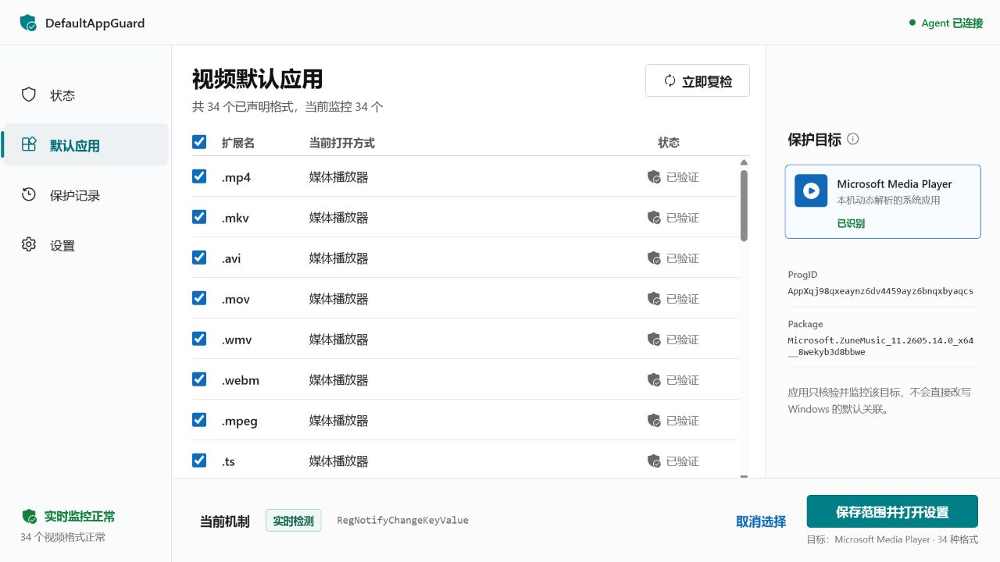

# DefaultAppGuard Community

DefaultAppGuard is a Windows 11 utility that monitors the current user's video
file associations and checks whether they still resolve to Microsoft Media
Player.

The project is currently an alpha. It detects drift and opens Windows' supported
Default Apps surface for user-driven repair. It does not silently overwrite
`UserChoice`, bypass UCPD, or claim an unbreakable hard lock.

> 中文简介：这是一个面向 Windows 11 的默认应用监控工具。它用 Windows
> COM 接口核验视频格式的实际默认程序，并在被其他软件改动后提示用户通过系统
> “默认应用”页面恢复。Windows Home 不支持可靠的静默强制锁定，因此本项目不会
> 伪造“永久锁定”能力。



## Download

Download the versioned ZIP and its `.sha256` file from GitHub Releases. Extract
the complete archive, read `ENVIRONMENT-AND-RISKS.txt`, and double-click
`DefaultAppGuard.Setup.exe`. The PowerShell installer remains available for
source review and advanced operation.

The current alpha is unsigned. Verify the checksum before installation:

```powershell
Get-FileHash .\DefaultAppGuard-0.1.7-win-x64.zip -Algorithm SHA256
```

Read [ENVIRONMENT-AND-RISKS.txt](ENVIRONMENT-AND-RISKS.txt) before
installation. It provides the supported environment, unsigned-software warning,
privacy boundary, known limitations, and license notice in Chinese and English.
The release gate requires this file to be reviewed and version-matched for every
release.

Version 0.1.7 packages contain a per-file SHA-256 manifest. The graphical Setup
launcher runs without a console or administrator elevation. Before starting
PowerShell, native Setup code independently verifies the package manifest,
file set, lengths, and SHA-256 hashes. Setup uses `ExecutionPolicy Bypass` only
for its hidden child process so a verified package extracted from a web
download can run; it does not save or change the user or computer policy, and
Group Policy still takes precedence. The transactional installer verifies the
package again before stopping an existing Agent, stages the complete update,
and restores the previous files and scheduled task if the new Agent fails its
identity, primary-algorithm readiness, or no-console checks. Readiness requires
Microsoft Media Player target resolution and primary COM-query evidence for
every protected format; association drift itself does not block installation.
Successful installation also creates a current-user entry in Windows
**Installed apps** with a hidden, ownership-checked uninstall command. A late
failure restores the previous package, task, install state, shortcut, and
uninstall registration as one transaction.

Release assets also include a Microsoft SBOM Tool-generated SPDX 2.2 software
bill of materials and checksum. The release gate validates the SBOM against
the exact package, then installs that package in isolation and verifies the
real monitor, transactional rollback, the watchdog's exact arguments,
current-user privilege, triggers, single-instance and restart settings,
automatic recovery, diagnostics, and clean uninstall before publication.

See [docs/USER-GUIDE.md](docs/USER-GUIDE.md) for installation, use,
diagnostics, and uninstallation.

## Main Algorithm

1. Resolve the installed Microsoft Media Player target dynamically.
2. Query every protected extension through
   `IApplicationAssociationRegistration.QueryCurrentDefault`.
3. Treat `UserChoice` only as cross-evidence, never as a fallback.
4. subscribe to the current user's `FileExts` tree with
   `RegNotifyChangeKeyValue` and `REG_NOTIFY_THREAD_AGNOSTIC`.
5. Re-query the effective handlers after a real notification.
6. Run a periodic COM readback in case Windows performs a change that does not
   produce a registry notification.
7. Send repairs through the official Windows Default Apps UI.

See [docs/ALGORITHM-DECISIONS.md](docs/ALGORITHM-DECISIONS.md) for rejected
approaches and product boundaries.

## Repository

- `native/DefaultAppGuard.Core`: COM query, target resolution, planning, and
  registry notification.
- `native/DefaultAppGuard.Agent`: loopback API, monitor worker, persisted
  configuration, and packaged UI host.
- `native/DefaultAppGuard.Setup`: small NativeAOT graphical package launcher.
- `native/DefaultAppGuard.Tests`: unit tests plus real Windows integration
  tests.
- `src`: React application.
- `packaging`: self-contained publish, current-user install, and uninstall.

## Verification

```powershell
pnpm install --frozen-lockfile
.\packaging\Test-ReleaseGate.ps1 -Version 0.1.7 `
  -PackageManagerPath pnpm
```

The release gate runs the real COM and kernel registry-notification tests
separately and verifies their names in the test result. It requires Microsoft
Media Player to be installed and configured for every declared video format.
It also rejects a published Agent unless its PE subsystem is Windows GUI, which
prevents a scheduled watchdog start from opening a console window. Hosted CI
alone is intentionally insufficient for a release. The dedicated release
machine must not already be running another DefaultAppGuard Agent because the
product intentionally allows one instance per signed-in user.

## Build A Windows Package

```powershell
.\packaging\Publish-Windows.ps1 -CreateArchive
```

The script builds the React UI, a small NativeAOT graphical Setup launcher, and
a compressed, self-contained `win-x64` Agent. The output includes installation
and uninstallation scripts,
the redacted diagnostics script, a per-file integrity manifest, and the
versioned bilingual environment and risk notice. See
[docs/USER-GUIDE.md](docs/USER-GUIDE.md) and
[docs/MAINTAINER-GUIDE.md](docs/MAINTAINER-GUIDE.md).

## Release And Trust

- The binary and PowerShell scripts are not code-signed.
- The alpha has only been installation-tested on Windows 11 25H2, x64.
- Release evidence records the Authenticode status of every executable,
  installer, uninstaller, diagnostics script, and package module. A partially
  signed or invalidly signed release is rejected.
- The `require-signed` path can sign the fresh payload with a code-signing
  certificate available through the Windows certificate store or an attached
  HSM before the package manifest is generated. Version 0.1.7 remains an
  unsigned alpha unless its release notes explicitly state otherwise.

See [docs/RELEASE.md](docs/RELEASE.md) for the GitHub release gate and
[docs/CODE-SIGNING.md](docs/CODE-SIGNING.md) for the SignPath Foundation and
Microsoft Artifact Signing options.

## License

DefaultAppGuard is source-available under the
[PolyForm Noncommercial License 1.0.0](LICENSE.md). It may be used, changed,
and redistributed for permitted noncommercial purposes under those terms.
Commercial use is not granted.

This is a noncommercial source-available license, not an OSI-approved open
source license. Redistributions must include both `LICENSE.md` and `NOTICE`.
