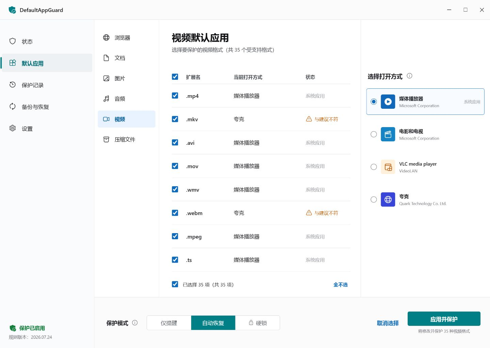

# DefaultAppGuard Community

DefaultAppGuard is a Windows 11 utility that monitors the current user's video
file associations and checks whether they still resolve to Microsoft Media
Player.

The project is currently an alpha. It detects drift and opens Windows' supported
Default Apps surface for user-driven repair. It does not silently overwrite
`UserChoice`, bypass UCPD, or claim an unbreakable hard lock.

> 中文简介：这是一个面向 Windows 11 的默认应用监控工具。它用 Windows
> COM 接口核验视频格式的实际默认程序，并在被其他软件改动后提示用户通过系统
> “默认应用”页面恢复。Windows Home 不支持可靠的静默强制锁定，因此本项目不会
> 伪造“永久锁定”能力。



## Download

Download the versioned ZIP and its `.sha256` file from GitHub Releases. Extract
the complete archive, review `Install-DefaultAppGuard.ps1`, and run it from
PowerShell.

The current alpha is unsigned. Verify the checksum before installation:

```powershell
Get-FileHash .\DefaultAppGuard-0.1.0-win-x64.zip -Algorithm SHA256
```

See [docs/USER-GUIDE.md](docs/USER-GUIDE.md) for installation, use, diagnostics,
and uninstallation.

## Main Algorithm

1. Resolve the installed Microsoft Media Player target dynamically.
2. Query every protected extension through
   `IApplicationAssociationRegistration.QueryCurrentDefault`.
3. Treat `UserChoice` only as cross-evidence, never as a fallback.
4. subscribe to the current user's `FileExts` tree with
   `RegNotifyChangeKeyValue` and `REG_NOTIFY_THREAD_AGNOSTIC`.
5. Re-query the effective handlers after a real notification.
6. Run a periodic COM readback in case Windows performs a change that does not
   produce a registry notification.
7. Send repairs through the official Windows Default Apps UI.

See [docs/ALGORITHM-DECISIONS.md](docs/ALGORITHM-DECISIONS.md) for rejected
approaches and product boundaries.

## Repository

- `native/DefaultAppGuard.Core`: COM query, target resolution, planning, and
  registry notification.
- `native/DefaultAppGuard.Agent`: loopback API, monitor worker, persisted
  configuration, and packaged UI host.
- `native/DefaultAppGuard.Tests`: unit tests plus real Windows integration
  tests.
- `src`: React application.
- `packaging`: self-contained publish, current-user install, and uninstall.

## Verification

```powershell
pnpm install --frozen-lockfile
.\packaging\Test-ReleaseGate.ps1 -Version 0.1.0 `
  -PackageManagerPath pnpm
```

The release gate runs the real COM and kernel registry-notification tests
separately and verifies their names in the test result. It requires Microsoft
Media Player to be installed and configured for every declared video format.
Hosted CI alone is intentionally insufficient for a release.

## Build A Windows Package

```powershell
.\packaging\Publish-Windows.ps1 -CreateArchive
```

The script builds the React UI and publishes a compressed, self-contained
`win-x64` Agent. The output includes installation and uninstallation scripts.
See [docs/USER-GUIDE.md](docs/USER-GUIDE.md) and
[docs/MAINTAINER-GUIDE.md](docs/MAINTAINER-GUIDE.md).

## Release And Trust

- The binary and PowerShell scripts are not code-signed.
- A project license has not been selected.
- The alpha has only been installation-tested on Windows 11 25H2, x64.

See [docs/RELEASE.md](docs/RELEASE.md) for the GitHub release gate and
[docs/CODE-SIGNING.md](docs/CODE-SIGNING.md) for the SignPath Foundation and
Microsoft Artifact Signing options.
